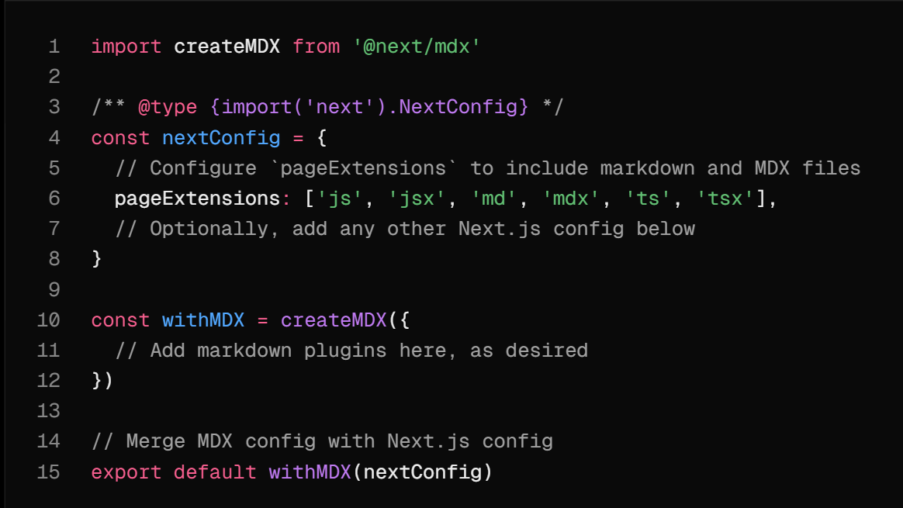
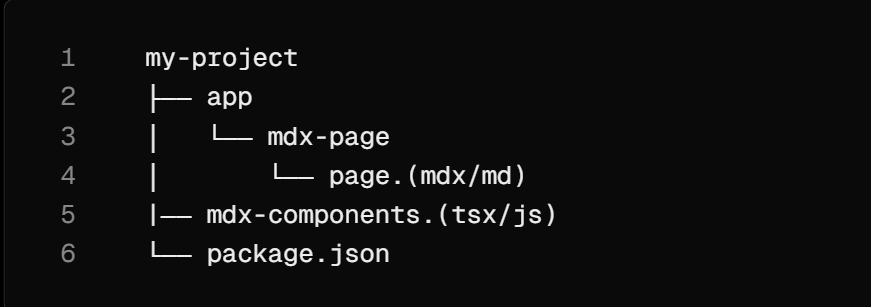

This is a [Next.js](https://nextjs.org) project bootstrapped with [`create-next-app`](https://nextjs.org/docs/app/api-reference/cli/create-next-app).

## Getting Started

First, run the development server:

```bash
npm run dev
# or
yarn dev
# or
pnpm dev
# or
bun dev
```

Open [http://localhost:3000](http://localhost:3000) with your browser to see the result.

You can start editing the page by modifying `app/page.tsx`. The page auto-updates as you edit the file.

This project uses [`next/font`](https://nextjs.org/docs/app/building-your-application/optimizing/fonts) to automatically optimize and load [Geist](https://vercel.com/font), a new font family for Vercel.

## Working with Nextjs MDX :

* Visite this page : https://nextjs.org/docs/app/guides/mdx
* Installe this bibliotheques : npm install @next/mdx @mdx-js/loader @mdx-js/react @types/mdx
* Configure next.config.mjs or .js 
* Ajouter un mdx-Component.jsx dans src ou dans le root de l'application.
* Vous pouvez restituer MDX en utilisant le routage basé sur les fichiers de Next.js ou en important des fichiers MDX dans d'autres pages:

Lorsque vous utilisez le routage basé sur des fichiers, vous pouvez utiliser les pages MDX comme n'importe quelle autre page.

Dans les applications App Router, cela inclut la possibilité d'utiliser [des métadonnées](https://nextjs.org/docs/app/getting-started/metadata-and-og-images) .

Créez une nouvelle page MDX dans le `/app` répertoire : 

* Dans le dossier src/app/blog on va créer un dossier abc dans le quel on crée lr fichier page.mdx:

# Blockchain Fundamentals

### Smart Contract Example

```solidity

pragma solidity ^0.8.0;

contract SimpleStorage {

    uint256 public storedData;


    function set(uint256 x) public {

        storedData = x;

    }

    function get() public view returns (uint256) {

        return storedData;

    }

}

```

## Use Cases

- Supply chain management
- Decentralized finance
- Identity verification


Etape suivante:

* Créer un mdx-layout.jsx dans le dossier components et lui ajouter le mdx-layout.module.css
* Puis le fichier page.mdx sera enrobé par `<MdxLayout></MdxLayout`>
*
